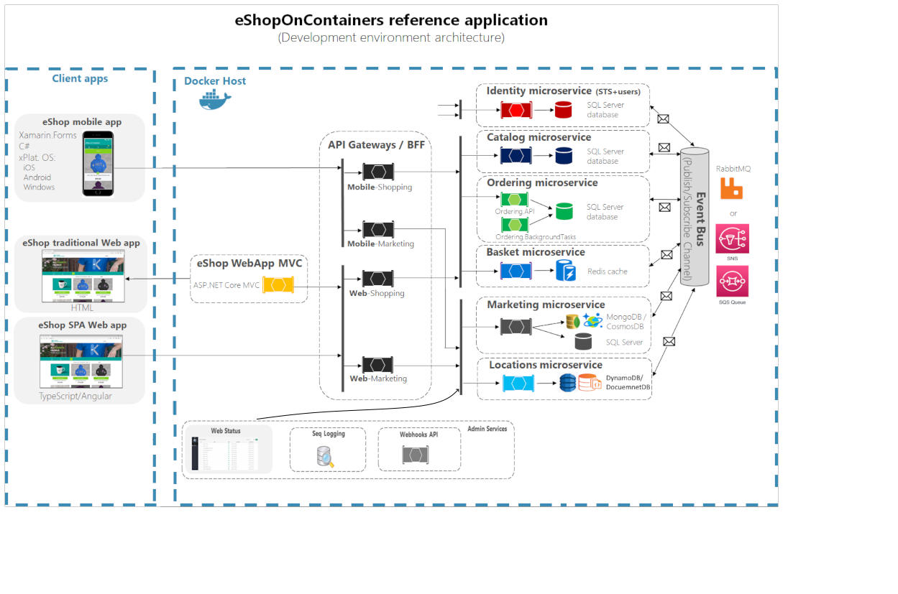

<a href="https://dot.net/architecture">
   
</a>

# .NET Microservices Sample Reference Application for AWS

This is a fork and opiniated project to translate all the eshopOnContainers sample application from Azure cloud to AWS. 

## AWS Components

- IAM 
- Route53 
- VPC 
- CloudWatch 
- CloudFront 
- EC2
- ECR
- CertificateManager
- S3 
- CDK 
- EKS 
- Lambda 
- RDS
- DocumentDB
- ElasticCache
- SecretsManager
- AMP
- Grafana
- WAF
- AMQ
- SQS
- SNS
- XRay
- CodeBuild
- LocalStack
- ALB
- Nat Gateway
- FarGate
- VPN
- Bastion

## K8s components 

- Istio
- Helm
- Flux
- Kustomization
- GateKeeper
- External DNS
- ALB Controller
- Metrics Server
- HPA
- Cluster Autoscaler
- ContainerInsights
- NGINX
- KubeCost
- Weaver
- EBS CSI

## Other components

- GitHub actions
- Rebus
- Jaeger
- Loki
- OTEL (Open Telemetry)

## Build Status (GitHub Actions)

| Image | Status | Image | Status |
| ------------- | ------------- | ------------- | ------------- |
| Web Status |  [](https://github.com/zodraz/eShopOnContainersAWS/actions?query=workflow%3Awebstatus) | Shopping Aggregator (Web) | [](https://github.com/zodraz/eShopOnContainersAWS/actions?query=workflow%3Awebshoppingagg) |
| Basket API | [](https://github.com/zodraz/eShopOnContainersAWS/actions?query=workflow%3Abasket-api) | Shopping Aggregator (Mobile) | [](https://github.com/zodraz/eShopOnContainersAWS/actions?query=workflow%3Amobileshoppingagg) |
| Catalog API | [](https://github.com/zodraz/eShopOnContainersAWS/actions?query=workflow%3Acatalog-api) | Web Client (MVC) | [](https://github.com/zodraz/eShopOnContainersAWS/actions?query=workflow%3Awebmvc) |
|Identity API | [](https://github.com/zodraz/eShopOnContainersAWS/actions?query=workflow%3Aidentity-api) | Web Client (SPA) | [](https://github.com/zodraz/eShopOnContainersAWS/actions?query=workflow%3Awebspa) |
| Ordering API | [](https://github.com/zodraz/eShopOnContainersAWS/actions?query=workflow%3Aordering-api) | Webhooks Client | [](https://github.com/zodraz/eShopOnContainersAWS/actions?query=workflow%3Awebhooks-client) |
| Payment API | [](https://github.com/zodraz/eShopOnContainersAWS/actions?query=workflow%3Apayment-api) | Ordering SignalR | [](https://github.com/zodraz/eShopOnContainersAWS/actions?query=workflow%3Aordering-signalrhub) | |

<!--_**aws** branch contains the latest **beta** code and their images are tagged with `:linux-aws` in our ECR.-->


<!---->

## Getting Started

Make sure you have [installed](https://docs.docker.com/docker-for-windows/install/) and [configured](https://github.com/dotnet-architecture/eShopOnContainers/wiki/Windows-setup#configure-docker) docker in your environment. After that, you can run the below commands from the **/src/** directory and get started with the `eShopOnContainers` immediately.

```powershell
docker-compose build
docker-compose up
```

You should be able to browse different components of the application by using the below URLs :

```
Web Status : http://host.docker.internal:5107/
Web MVC :  http://host.docker.internal:5100/
Web SPA :  http://host.docker.internal:5104/
```

> Note: If you are running this application in macOS then use `docker.for.mac.localhost` as DNS name in `.env` file and the above URLs instead of `host.docker.internal`.

Below are the other avenues to setup _eShopOnContainers_.

### Basic scenario

The basic scenario can be run locally using docker-compose, and also deployed to a local Kubernetes cluster. Refer to these Wiki pages to Get Started:

- [Visual Studio (F5 experience)](https://github.com/dotnet-architecture/eShopOnContainers/wiki/Windows-setup#optional---use-visual-studio)
- [Docker compose on windows](https://github.com/dotnet-architecture/eShopOnContainers/wiki/Windows-setup)
- [Docker compose on macOS](https://github.com/dotnet-architecture/eShopOnContainers/wiki/Mac-setup)
- [Local Kubernetes](https://github.com/dotnet-architecture/eShopOnContainers/wiki/Deploy-to-Local-Kubernetes)

### AWS scenario

- Create all the proper images on ECR from GitHub actions
- Deploy all the AWS infrastructure through CDK
- Update all required configurations on inf.yaml
- Execute post deployment script actions
- Deploy all charts either from GitHub actions or locally from deploy-all script


## IMPORTANT NOTES!

**You can use either the latest version of Visual Studio or simply Docker CLI and .NET CLI for Windows, Mac, and Linux**.

**Note for Pull Requests (PRs)**: We accept pull requests from the community. When doing it, please do it onto the **DEV branch** which is the consolidated work-in-progress branch. Do not request it onto **main** branch.


> **PLEASE** Read our [branch guide](./branch-guide.md) to know about our branching policy
>
> ### DISCLAIMER
>
> **IMPORTANT:** The current state of this sample application is an opiniated fork from the original eshopOnContainers. And does not tag along from its fork with many differences-

### Architecture overview

This reference application is cross-platform at the server and client-side, thanks to .NET 6 services capable of running on Linux or Windows containers depending on your Docker host, and to Xamarin for mobile apps running on Android, iOS, or Windows/UWP plus any browser for the client web apps.

The architecture proposes a microservice oriented architecture implementation with multiple autonomous microservices (each one owning its own data/db) and implementing different approaches within each microservice (simple CRUD vs. DDD/CQRS patterns) using HTTP as the communication protocol between the client apps and the microservices and supports asynchronous communication for data updates propagation across multiple services based on Integration Events and an Event Bus (a light message broker, to choose between RabbitMQ or Azure Service Bus, underneath) plus other features defined at the [roadmap](https://github.com/dotnet-architecture/eShopOnContainers/wiki/Roadmap).




